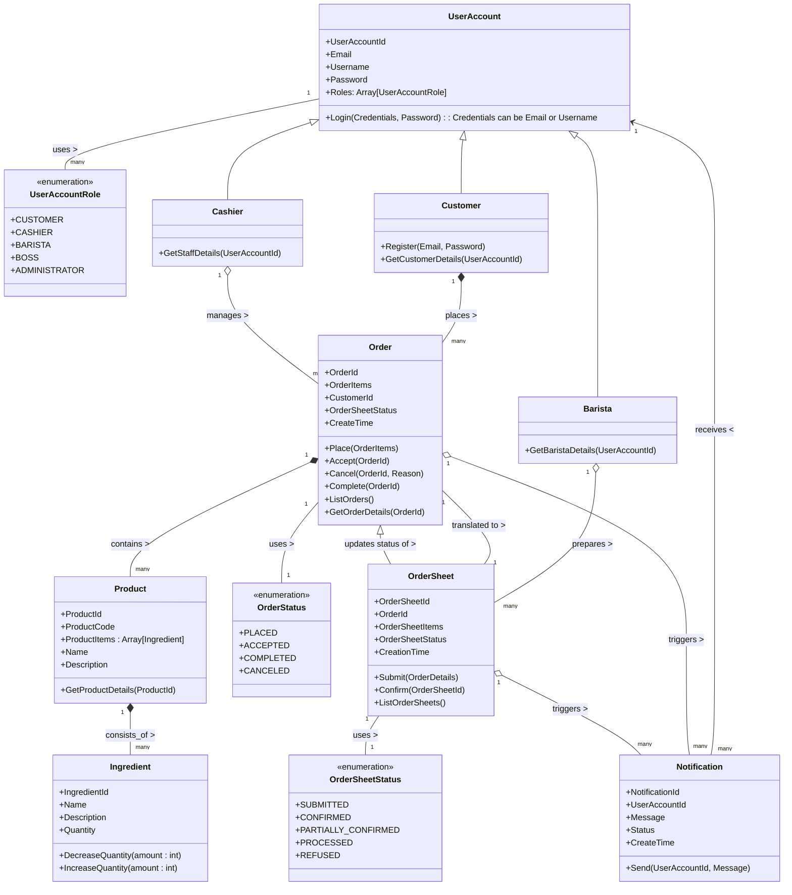

Building modular monolith using spring
===

이 저장소는 [Spring](https://spring.io/projects)을 기반으로 한 모듈형 모노리스 시스템의 설계와 구현을 보여주기 위해 만들어졌습니다.

### 다루는 내용

이 저장소에서 다루는 주요 주제는 다음과 같습니다:

- 모듈 방식으로 모노리스 시스템을 구현하는 방법을 제시합니다.
- 소프트웨어 설계 원칙과 디자인 패턴, 객제지향 기술의 모범 사례를 활용합니다.
- 도메인 주도 설계가 제안하는 전략적, 전술적 설계를 활용합니다.
- 운영 환경에서 바로 실행할 수 있는 수준의 완성된 코드 제공합니다.
- API-first 접근 방식을 채택하여, 모든 기능 개발을 API 설계와 구현을 선행하는 방식으로 진행합니다.

### 다루지 않는 내용

이 저장소에서는 다음 주제들을 다루지 않습니다:

- 비즈니스 요구 사항의 수집 및 분석
- 아키텍처 평가 및 품질 속성 분석
- 인프라, 컨테이너화
- 배포 프로세스
- 문서화

## 알림

소프트웨어 아키텍처 결정에는 기능 요구 사항, 품질 수준, 기술적 제약뿐만 아니라 조직의 선호, 경험, 비용 등 다양한 요소가 고려됩니다. 따라서 이 저장소에서 제시된 아키텍처와 구현 방법은 다양한 문제를 해결할 수 있는 여러 방법의 하나일 뿐입니다.

이 저장소의 코드를 필요에 따라 자유롭게 사용하셔도 좋지만, 여러분의 상황에 가장 적합한 해결책을 찾아 선택하는 것이 중요합니다.

이 프로젝트에서 우리가 집중하는 것은 코드의 품질입니다. 고품질 코드를 만들기 위해선 상당한 분석, 연구, 그리고 노력이 필요합니다. 그러니 이 프로젝트가 마음에 드시거나 유용하셨다면, 별(⭐)을 주세요! 이는 우리가 이 저장소를 관리하는 데 있어 큰 동기부여가 됩니다. 감사합니다.

> _이 프로젝트는 [Modular Monolith with DDD](https://github.com/kgrzybek/modular-monolith-with-ddd)에서 영감을 받아 시작되었습니다._

## 도메인 Domain

프로젝트 "커피하우스 coffeehouse"는 `전자 상거래 e-commerce` 서비스입니다. 이 서비스는 고객이 휴대폰, 태블릿, 노트북 등 디지털 기기를 통해 언제 어디서나 커피하우스의 제품(음료, 빵 등)을 간편하게 주문하고, 준비가 완료되면 픽업할 수 있는 서비스를 제공합니다.

이 도메인을 선택한 이유는 다음과 같습니다:

- 모바일 오더와 픽업 서비스는 이미 많은 사람들에게 친숙한 개념이며, 많은 회사들이 이와 유사한 e-commerce 서비스를 만들고 있습니다.
- 서비스 구조가 비교적 단순하고 이해하기 쉬워, 큰 규모의 시스템 구축에 앞서 기본적인 비즈니스 규칙과 로직을 적용하여 실습해볼 수 있습니다.
- 주문 서비스는 단순한 CRUD(생성, 조회, 수정, 삭제) 작업을 넘어서는 비즈니스 규칙과 로직을 포함하고 있어, 다양한 기술적 도전을 경험할 수 있습니다.
- 금융, 의료와 같이 특정한 도메인 지식을 필요로 하는 다른 분야와 달리, 누구나 쉽게 접근하고 이해할 수 있으며, 특별한 전문 지식을 요구하지 않습니다.

### 사용자 스토리 User Story

- [ ] 고객은 다양한 음료와 베이커리 항목을 선택하고 주문함으로써, 원하는 메뉴를 간편하게 즐길 수 있습니다. 
- [ ] 고객은 주문 시 사용 가능한 픽업 옵션(즉시 픽업, 지정된 시간대 픽업) 중에서 선택할 수 있어, 자신의 일정에 맞춰 주문 할 수 있습니다.
- [ ] 고객은 신용카드, 모바일 결제 등 다양한 결제 방식 중에서 선택하여 안전하고 편리하게 결제할 수 있습니다.
- [ ] 고객은 주문 상태를 실시간으로 추적하고, 픽업 시간을 효율적으로 계획할 수 있습니다. 
- [ ] 고객은 상품이 준비되면 즉각적인 픽업 알림을 받음으로써, 대기 시간 없이 픽업을 진행할 수 있습니다. 
- [ ] 고객은 픽업 후 서비스 경험에 대해 별점 평가와 피드백을 남김으로써, 서비스 개선에 기여할 수 있습니다. 
- [ ] 고객은 과거 주문 내역을 확인하고 좋아하는 메뉴를 손쉽게 재주문함으로써, 빠르고 편리하게 자주 구매하는 상품을 다시 주문할 수 있습니다.
- [ ] 고객은 상품에 대한 별점 평가와 후기를 남길 수 있으며, 다른 고객의 후기를 통해 상품 선택에 도움을 받을 수 있습니다.
- [ ] 고객은 커피하우스 매장의 위치, 실시간 영업 상태 및 영업 시간을 확인할 수 있어, 방문 계획을 쉽게 세울 수 있습니다. 
- [ ] 직원은 고객의 주문을 확인하고 접수함으로써, 주문 처리 과정을 신속하고 효율적으로 관리할 수 있습니다.
- [ ] 직원은 운영 상황(예: 재료 부족, 주문 폭주 등)에 따라 필요한 경우 주문을 거부할 수 있으며, 이를 통해 서비스의 질을 유지하고 관리할 수 있습니다. 
- [ ] 직원은 고객의 서비스 이용 경험에 대한 평가와 피드백을 주기적으로 검토하고, 이를 바탕으로 서비스를 개선하여 고객 만족도를 높일 수 있습니다.
- [ ] 직원은 고객이 남긴 상품 평가와 후기를 확인하고, 후기에 답변을 남김으로써 고객과의 소통을 강화할 수 있습니다. 
- [ ] 직원은 커피하우스 매장의 위치, 실시간 영업 상태 및 영업 시간을 쉽게 변경하고, 관리할 수 있습니다. 
- [ ] 바리스타는 접수된 주문을 확인하고 준비를 시작함으로써, 주문을 효율적으로 처리하고 고객 만족을 보장할 수 있습니다.
- [ ] 바리스타는 재료 부족 등의 이유로 주문을 거부할 수 있으며, 이를 통해 서비스 품질을 유지하고 고객에게 정확한 정보를 제공할 수 있습니다.
- [ ] 바리스타는 상품 준비가 완료되면 고객에게 픽업 요청을 보냄으로써, 고객이 주문을 신속하게 받아갈 수 있도록 돕습니다.

### 도메인 모델 Domain Model

> [!NOTE]
> 도메인 모델은 객체들이 도메인 논리를 표현하고 구현하는 방식으로 모델에는 업무 규칙을 나타내는 객체와, 
> 그 업무 규칙을 처리하면서 필요한 데이터를 포함하는 객체가 혼재되어 있다. 이 객체들이 서로 상호작용하며 도메인 논리를 처리한다.
>
> [도서, 엔터프라이즈 애플리케이션 아키텍처 패턴](https://martinfowler.com/books/eaa.html)

## 구현 Implement

### API Design First

`API Design First`는 소프트웨어 개발 프로세스에서 API를 우선적으로 설계하는 접근 방식입니다. 이 방법론은 API를 시스템의 핵심 구성 요소로 간주하며, 애플리케이션의 다른 부분을 개발하기 전에 먼저 API의 설계와 문서화에 중점을 둡니다. API Design Design의 목표는 더 효율적이고 일관된 개발 프로세스를 제공하며, 향후 확장성과 유지보수성을 향상시키는 것입니다.

[OpenAPI Specification](https://www.openapis.org)과 [OpenAPI Generator](https://openapi-generator.tech)를 활용함으로써, API Design First 접근 방식을 효과적으로 구현할 수 있으며, API의 일관성과 품질을 보장하는 동시에 개발 프로세스를 간소화하고 가속화할 수 있습니다.

#### OpenAPI Specification (OAS)

`OpenAPI Specification`은 API 설계를 위한 표준 언어입니다. 이를 통해 개발자는 RESTful API의 모든 요소(엔드포인트, 요청 및 응답 형식, 인증 방법 등)를 명확하게 정의하고 문서화 할 수 있습니다. OAS를 사용하면, API의 구조를 쉽게 이해하고, 다양한 도구와의 호환성을 보장할 수 있습니다. 또한, API 문서가 실제 API 구현과 동기화되어 있음을 보장하며, 이는 API의 사용성과 유지보수성을 크게 향상시킵니다.

#### OpenAPI Generator

`OpenAPI Generator`는 `OpenAPI Specification`으로부터 서버 스텁, 클라이언트 라이브러리, API 문서 등을 자동으로 생성하는 도구입니다. 이 도구를 사용하면, API 명세서를 기반으로 초기 개발 작업을 자동화하고, 개발 프로세스를 가속화할 수 있습니다. `OpenAPI Generator`는 여러 언어와 프레임워크를 지원하므로, 개발 팀이 선호하는 기술 스택을 사용하여 API를 신속하게 구현할 수 있습니다.

> [!TIP]
> An API-first approach to building products can benefit your organization in many ways. 
> And API first approach requires that teams plan, organize, and share a vision of their API program. 
> It also requires adopting tools that support an API first approach.
>
> [Article, Understanding  the API-First Approach to Building Products](https://swagger.io/resources/articles/adopting-an-api-first-approach/)

### 아키텍처 Architecture

#### 원칙

시스템은 다양한 외부요소로 지속해서 영향받아 변할 수밖에 없습니다. 시스템 구조를 바꾸는 것이 쉬운 건 아니지만, 환경에 적응할 수 있는 시스템을 개발해야 합니다.

> [!IMPORTANT]
> 좋은 아키텍처는 시스템이 모노리틱 구조로 태어나서 단일 파일로 배포되더라도, 이후에는 독립적으로 배포 가능한 단위들의 집합으로 성장하고, 
> 또 독립적인 서비스나 마이크로서비스 수준까지 성장할 수 있도록 만들어져야 한다. 
> 또한 좋은 아키텍처라면 나중에 상황이 바뀌었을 때 이 진행 방향을 거꾸로 돌려 원래 형태인 모노리틱 구조로 되돌릴 수도 있어야 한다.
>
> [도서, 클린 아키텍처](https://ebook.insightbook.co.kr/book/69)

#### 모듈형 모노리스 Modular Monolith

> 한줄요약, 모노리스는 정확히 하나의 배포 단위가 있는 시스템에 지나지 않습니다. 그 이상도 이하도 아닙니다.
>
> [Article, MODULAR MONOLITH: A PRIMER](https://www.kamilgrzybek.com/blog/posts/modular-monolith-primer)

[모노리스(Monolith)](https://en.wikipedia.org/wiki/Monolithic_system) 방식은 소프트웨어 개발에서 한 개의 단일, 통합된 애플리케이션으로 전체 서비스의 기능을 구현하는 접근 방법입니다.

모노리스의 주요 특징은 다음과 같습니다:

- 단순성: 단일 코드 베이스와 개발 환경을 사용하기 때문에, 개발, 배포 및 관리가 상대적으로 단순합니다.
- 개발 용이성: 새로운 개발자가 프로젝트에 참여할 때, 전체 시스템의 구조를 이해하기가 비교적 용이합니다.
- 배포 용이성: 모든 서비스 구성요소가 하나의 애플리케이션으로 묶여 있기 때문에, 배포 과정이 간단하고 명확합니다.

모노리스 방식은 애플리케이션이 성장함에 따라 복잡성이 증가하고, 이에 따라 유지보수와 확장성에 어려움을 겪을 수도 있습니다. 크기가 크고 복잡한 시스템에서는 작은 변경 사항이라도 전체 시스템의 재빌드와 배포를 요구할 수 있으며, 이는 개발 속도를 저하시키고 운영 리스크를 증가시킬 수 있습니다. 그럼에도 불구하고, 프로젝트의 규모가 작거나 중간 정도일 때, 혹은 단일한 팀이 전체 애플리케이션을 관리 할 수 있을 때 모노리스 방식은 여전히 유용한 접근 방법입니다.

> [!TIP]
> Microservices are a useful architecture, but even their advocates say that using them incurs a significant
> MicroservicePremium, which means they are only useful with more complex systems. This premium, essentially 
> the cost of managing a suite of services, will slow down a team, favoring a monolith for simpler applications.
>
> [Article, Monolith First](https://martinfowler.com/bliki/MonolithFirst.html)

##### 모듈화 Modularization

단일 코드 베이스에서 시스템의 규모가 커질수록 소프트웨어의 복잡성이 증가합니다. 이러한 복잡성을 관리하기 위해 소프트웨어의 구조를 한눈에 파악할 수 있도록 명확한 경계를 설정하는 것이 필요합니다. 이 과정을 `모듈화 Modularization`라고 부릅니다. 소프트웨어는 물리적 형태가 없기 때문에 구조를 단순화하려면 서로 관련성이 높은 클래스들을 논리적 단위로 통합해야 합니다. 이렇게 관련된 클래스 집합을 하나의 논리적 단위로 결합하는 구성 요소를 `모듈 module`이라고 합니다.

즉, 모듈화는 큰 단일 코드 베이스를 더 작은 캡슐화된 기능 단위로 분할하고, 이렇게 분할된 작은 단위들이 서로 협력하여 전체 기능을 수행하게 하는 과정입니다. 모듈은 외부 사용을 위한 API를 제공하며, 자신이 작동하는 데 필요한 모든 요소를 포함해야 합니다. 또한, 모듈은 독립적으로 테스트 가능해야 하며, 다른 모듈과의 의존성은 최소화하는 것이 바람직합니다.

자바에서는 `패키지 package`를 사용해 모듈을 만들 수 있으며, 빌드 도구인 그레이들(Gradle)을 사용해서 단일 저장소에서 멀티프로젝트(multi-project)로 모듈을 구성할 수도 있습니다.

##### 수직 슬라이스 Vertical Slice

수직 슬라이스는 모노리스를 단일 프로세스 내에서 배포되는 일련의 작은 애플리케이션처럼 바라보는 아이디어에서 출발합니다. 이 접근법을 성공적으로 적용하기 위해서는 도메인에 대한 깊은 이해와 명확한 경계 식별이 필요합니다. 이 과정에는 도메인 주도 설계(Domain-Driven Design)와 이벤트 스토밍(Event Storming) 등의 기법이 활용될 수 있습니다.

- 수직 슬라이스는 모노리스 내에서 독립적인 비즈니스 기능 단위로 구성됩니다. 이러한 수직 슬라이스를 그룹화하여 모듈로 만들 수 있습니다. 이 접근 방식은 모듈이 기술적인 측면보다는 비즈니스 가치에 중점을 둘 수 있도록 합니다.
- 각 모듈은 특정 비즈니스 기능을 완전히 지원하기 위해 필요한 기능과 데이터를 자체적으로 포함하며, 이는 모듈이 비즈니스 목적 달성을 위해 필요한 모든 요소를 포함하고 있음을 보장합니다.
- 모듈 간 통신은 이벤트와 알림을 통해 서로의 상태 변경을 비동기적으로 통지함으로써 이루어지며, 필요에 따라 동기식 통신도 인터페이스를 통해 최소한의 의존성으로 진행됩니다. 이 접근 방식은 각 모듈의 독립성과 자율성을 유지하며 모듈 간의 강한 결합을 방지합니다.

이 접근법을 통해, 각 모듈은 마치 독립적인 소규모 애플리케이션처럼 기능하여 시스템 전체의 유연성과 확장성을 향상시킵니다. 이는 비즈니스 기능의 변경이 빈번히 발생하는 현대의 소프트웨어 개발 환경에 잘 맞습니다. 또한, 모노리스 방식의 애플리케이션이 겪는 한계를 극복합니다.

#### 계층화 Layering

수직 슬라이스된 모듈은 비즈니스 목적 달성을 위해 필요한 모든 요소를 포함하고 있기 때문에 단순하지 않습니다. 이를 해결하기 위해, 모듈 내에서 프레젠테이션(UI), 도메인(비즈니스 로직), 데이터와 같은 세 가지 주요 계층으로 세분화할 수 있습니다. 이 과정을 `계층화 Layering`라고 합니다. 계층화는 복잡한 소프트웨어 시스템을 이해하고 관리하기 쉬운 부분으로 나누는데 사용되는 가장 일반적인 기법 중 하나입니다. 이러한 구조는 각 계층이 특정 기능에 집중할 수 있도록 함으로써, 모듈 내부 복잡도를 효과적으로 낮추는 데 도움이 됩니다.

- 프레젠테이션 계층 presentation layer : 서비스 제공, 정보 표시, 사용자 및 HTTP 요청, 명령줄 호출, 일괄 작업 API 처리
- 도메인 계층 domain layer : 시스템의 핵심이 되는 논리
- 데이터 계층 data layer : 데이터베이스, 메시징 시스템, 트랜잭션 관리자 및 다른 패키지와의 통신

의존 방향은 일반적으로 계층 구조을 따라 위에서 아래로 흐르며, 프레젠테이션 계층은 도메인 계층에 의존하고, 도메인 계층은 데이터 계층에 의존합니다. 흔히 사용되는 변형으로는 도메인 계층과 데이터 계층 사이에 [매퍼 Mapper](https://martinfowler.com/eaaCatalog/mapper.html)를 도입해 도메인 계층이 데이터 계층의 구체적 구현에 직접 의존하지 않도록 구성하는 방식이 있습니다. 이러한 구조는 [육각형 아키텍처(또는 포트와 어댑터 아키텍처)](https://en.wikipedia.org/wiki/Hexagonal_architecture_(software)) 로도 알려져 있으며, 시스템의 유연성을 높이고 도메인 로직의 순수성을 유지하는 데 도움을 줍니다.

### 통합 테스트 Integration Testing

> TBD

### 소프트웨어 스택 Software Stack

구현에 사용되는 기술, 프레임워크 및 라이브러리 목록입니다:

- Java 21
- Spring Framework 6.x
- Spring Boot 3.x
- Spring Data JDBC 3.x
- Jackson 2.x
- [Gradle](https://gradle.org) (build tools)
- [H2 Database](http://www.h2database.com/html/main.html) (database)
- [Docker Compose](https://docs.docker.com/compose/)

### 아키텍처 의사 결정 기록 Architectural Decision Records (ADRs)

프로젝트 진행 과정에서 내린 의사 결정에 대해 [아키텍처 의사 결정 기록(Architecture Decision Record, ADRs)](https://adr.github.io)을 남깁니다.

> [docs/architecture-decision-records](docs/architecture-decision-records)

문서 관리는 [ADR Tools](https://github.com/npryce/adr-tools?tab=readme-ov-file)을 사용합니다.

## 빌드 및 실행 방법 Build and Run

저장소를 복제하거나 압축 파일로 내려받은 받은 후 터미널에서 다음과 같은 방법으로 실행할 수 있습니다.

### 그레이들로 실행하기 Run using Gradle

> ❯ ./gradlew bootRun --args='--spring.profiles.active=local' --parallel --max-workers=4

### 도커 컴포즈로 실행하기 Run using Docker Compose

> ❯ docker-compose up --build -d

## 라이선스 License

라이선스 권한과 제한 사항에 대해서는 [LICENSE](LICENSE.md) 파일을 참조하세요 (MIT).

## 참조 Reference

### 모듈형 모노리스 Modular Monolith

- ["Building Better Monoliths – Modulithic Applications with Spring Boot"](https://speakerdeck.com/olivergierke/building-better-monoliths-modulithic-applications-with-spring-boot-cd16e6ec-d334-497d-b9f6-3f92d5db035a)
  자료, Oliver Drotbohm
- ["Modular Monoliths"](https://www.youtube.com/watch?v=5OjqD-ow8GE) 영상, 시몬 브라운(Simon Brown)
- ["Pattern: Monolithic Architecture"](https://microservices.io/patterns/monolithic.html) 글, 크리스 리처드슨(Chris Richardson)
- ["MonolithFirst"](https://martinfowler.com/bliki/MonolithFirst.html) 글, 마틴 파울러(Martin Fowler)

### 애플리케이션 아키텍처 Application Architecture

- ["엔터프라이즈 애플리케이션 아키텍처 패턴: 엔터프라이즈 아키텍처 구축을 위한 객체 지향 설계의 원리와 기법"](https://martinfowler.com/books/eaa.html) 도서, 저자: 마틴 파울러(Martin Fowler), 역자: 최민석
- ["클린 아키텍처: 소프트웨어 구조와 설계 원칙"](https://ebook.insightbook.co.kr/book/69) 도서, 저자: 로버트 C. 마틴(Robert C. Martin), 역자: 송준이
- ["만들면서 배우는 클린 아키텍처: 자바 코드로 구현하는 클린 웹 애플리케이션"](https://wikibook.co.kr/clean-architecture/) 도서, 저자: 톰 홈버그(Tom Hombergs), 역자: 박소은
- ["Hexagonal/Ports & Adapters Architecture"](https://web.archive.org/web/20180822100852/http://alistair.cockburn.us/Hexagonal+architecture) 글, 알리스테어 콕번(Alistair Cockburn)

### 시스템 아키텍처 System Architecture

- ["기업 통합 패턴 Enterprise Integration Patterns: 기업 분산 애플리케이션 통합을 위한 메시징 해결책"](http://www.acornpub.co.kr/book/enterprise-integration-patterns) 도서, 저자: 그레거 호프(Gregor Hohpe) 바비 울프(Bobby Woolf), 역자: 차정호
- ["마이크로서비스 아키텍처 구축: 대용량 시스템의 효율적인 분산 설계 기법"](https://m.hanbit.co.kr/store/books/book_view.html?p_code=B8584207882) 도서, 저자: 샘 뉴먼(Sam Newman), 역자: 정성권

### 설계 Design

- ["오브젝트: 코드로 이해하는 객체지향 설계"](https://wikibook.co.kr/object/) 도서, 조영호
- ["토비의 스프링"](http://www.acornpub.co.kr/book/toby-spring3-1-set) 도서, 이일민
- ["OpenAPI와 스웨거를 활용한 실전 API 설계: 요구사항 분석부터 비즈니스 모델 설계, 문서화, 자동화, 테스트, API 확장과 진화까지"](https://www.onlybook.co.kr/entry/designing-API) 도서, 저자: 조시 포널랫(Joshua S. Ponelat) 루카스 로젠스톡(Lukas L. Rosenstock), 역자: 오명운
- ["도메인 주도 설계 핵심: 핵심을 간추린 비즈니스 중심의 설계로 소프트웨어 개발 프로젝트 성공하기"](http://acornpub.co.kr/book/domain-driven-design-distilled) 도서, 저자: 반 버논(Vaughn Vernon), 역자: 박현철, 전장호
- ["Java 9 모듈 프로그래밍: 자바 모듈 프로그래밍으로 재사용 가능하고 관리하기 쉬운 코드 작성하기"](https://m.hanbit.co.kr/store/books/book_view.html?p_code=B7608640342) 도서, 저자: 코시크 코타갈(Koushik Kothagal), 역자:유동환
