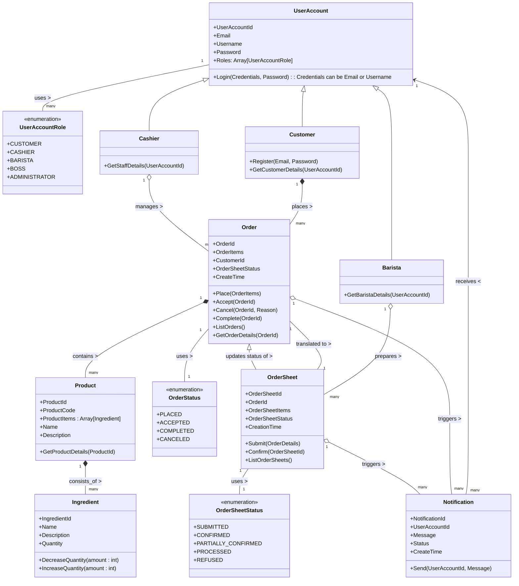

# Real-World Software Development: A Project-Driven Guide to Spring Applications

> 이 저장소는 실제 세계의 복잡한 요구 사항을 충족시키는 스프링 애플리케이션 개발을 탐구하는 곳입니다.

"커피하우스 시스템" 개발이라는 가상의 프로젝트를 중심으로 발생하는 다양한 기술적 도전을 경험하고, 이를 해결하기 위한 실용적인 접근 방법을 제공하고자 합니다. 이 저장소를 통해 이론적 지식과 실제 적용 사이의 간극을 메우고자 하는 소프트웨어 엔지니어에게 귀중한 자원이 되기를 바랍니다.

## 도메인 Domain

프로젝트 "커피하우스 coffeehouse"는 `전자 상거래 e-commerce` 서비스입니다. 이 서비스는 고객이 휴대폰, 태블릿, 노트북 등 디지털 기기를 통해 언제 어디서나 커피하우스의 제품(음료, 빵 등)을 간편하게 주문하고, 준비가 완료되면 픽업할 수 있는 서비스를 제공합니다.

이 도메인을 선택한 이유는 다음과 같습니다:

- 모바일 오더와 픽업 서비스는 이미 많은 사람들에게 친숙한 개념이며, 많은 회사들이 이와 유사한 e-commerce 서비스를 만들고 있습니다.
- 서비스 구조가 비교적 단순하고 이해하기 쉬워, 큰 규모의 시스템 구축에 앞서 기본적인 비즈니스 규칙과 로직을 적용하여 실습해볼 수 있습니다.
- 주문 서비스는 단순한 CRUD(생성, 조회, 수정, 삭제) 작업을 넘어서는 비즈니스 규칙과 로직을 포함하고 있어, 다양한 기술적 도전을 경험할 수 있습니다.
- 금융, 의료와 같이 특정한 도메인 지식을 필요로 하는 다른 분야와 달리, 누구나 쉽게 접근하고 이해할 수 있으며, 특별한 전문 지식을 요구하지 않습니다.

### 사용자 스토리 User Story

- [ ] 고객은 다양한 음료와 베이커리 항목을 선택하고 주문함으로써, 원하는 메뉴를 간편하게 즐길 수 있습니다. 
- [ ] 고객은 주문 시 사용 가능한 픽업 옵션(즉시 픽업, 지정된 시간대 픽업) 중에서 선택할 수 있어, 자신의 일정에 맞춰 주문 할 수 있습니다.
- [ ] 고객은 신용카드, 모바일 결제 등 다양한 결제 방식 중에서 선택하여 안전하고 편리하게 결제할 수 있습니다.
- [ ] 고객은 주문 상태를 실시간으로 추적하고, 픽업 시간을 효율적으로 계획할 수 있습니다. 
- [ ] 고객은 상품이 준비되면 즉각적인 픽업 알림을 받음으로써, 대기 시간 없이 픽업을 진행할 수 있습니다. 
- [ ] 고객은 픽업 후 서비스 경험에 대해 별점 평가와 피드백을 남김으로써, 서비스 개선에 기여할 수 있습니다. 
- [ ] 고객은 과거 주문 내역을 확인하고 좋아하는 메뉴를 손쉽게 재주문함으로써, 빠르고 편리하게 자주 구매하는 상품을 다시 주문할 수 있습니다.
- [ ] 고객은 상품에 대한 별점 평가와 후기를 남길 수 있으며, 다른 고객의 후기를 통해 상품 선택에 도움을 받을 수 있습니다.
- [ ] 고객은 커피하우스 매장의 위치, 실시간 영업 상태 및 영업 시간을 확인할 수 있어, 방문 계획을 쉽게 세울 수 있습니다. 
- [ ] 직원은 고객의 주문을 확인하고 접수함으로써, 주문 처리 과정을 신속하고 효율적으로 관리할 수 있습니다.
- [ ] 직원은 운영 상황(예: 재료 부족, 주문 폭주 등)에 따라 필요한 경우 주문을 거부할 수 있으며, 이를 통해 서비스의 질을 유지하고 관리할 수 있습니다. 
- [ ] 직원은 고객의 서비스 이용 경험에 대한 평가와 피드백을 주기적으로 검토하고, 이를 바탕으로 서비스를 개선하여 고객 만족도를 높일 수 있습니다.
- [ ] 직원은 고객이 남긴 상품 평가와 후기를 확인하고, 후기에 답변을 남김으로써 고객과의 소통을 강화할 수 있습니다. 
- [ ] 직원은 커피하우스 매장의 위치, 실시간 영업 상태 및 영업 시간을 쉽게 변경하고, 관리할 수 있습니다. 
- [ ] 바리스타는 접수된 주문을 확인하고 준비를 시작함으로써, 주문을 효율적으로 처리하고 고객 만족을 보장할 수 있습니다.
- [ ] 바리스타는 재료 부족 등의 이유로 주문을 거부할 수 있으며, 이를 통해 서비스 품질을 유지하고 고객에게 정확한 정보를 제공할 수 있습니다.
- [ ] 바리스타는 상품 준비가 완료되면 고객에게 픽업 요청을 보냄으로써, 고객이 주문을 신속하게 받아갈 수 있도록 돕습니다.

### 도메인 모델 Domain Model

> [!NOTE]
> 도메인 모델은 객체들이 도메인 논리를 표현하고 구현하는 방식으로 모델에는 업무 규칙을 나타내는 객체와, 그 업무 규칙을 처리하면서 필요한 데이터를 포함하는 객체가 혼재되어 있다. 이 객체들이 서로 상호작용하며
> 도메인 논리를 처리한다.
>
> [도서, 엔터프라이즈 애플리케이션 아키텍처 패턴](https://martinfowler.com/books/eaa.html)

## 라이선스 License

라이선스 권한과 제한 사항에 대해서는 [LICENSE](LICENSE.md) 파일을 참조하세요 (MIT).
